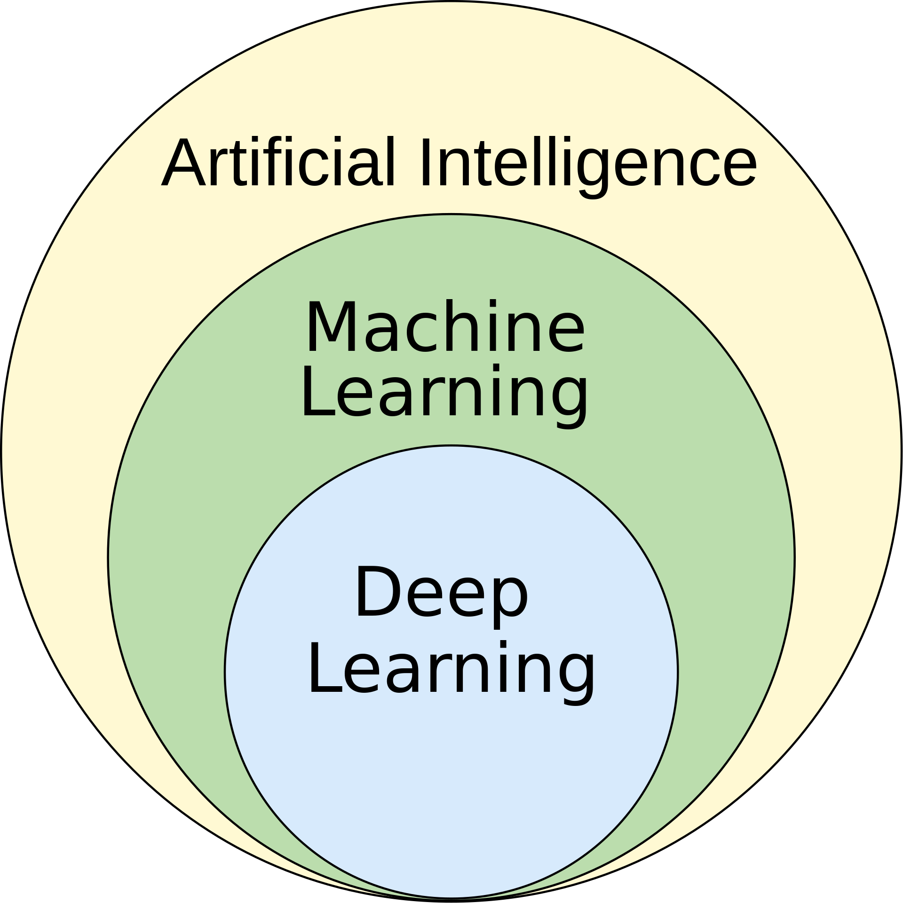
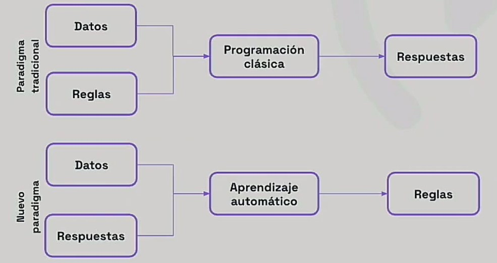
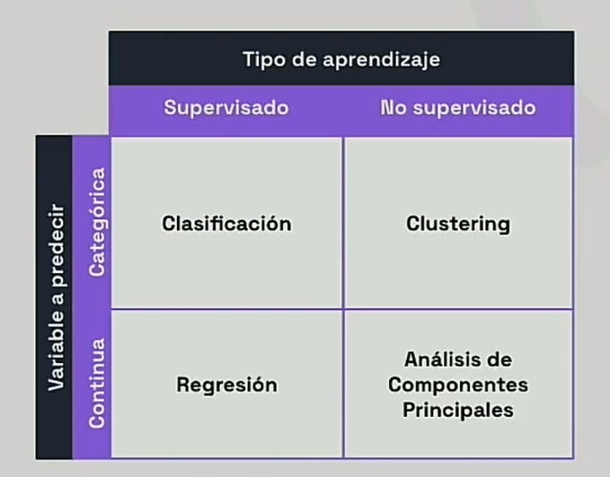

# Introducción a *Machine Learning*

## Definición

El *machine learning*, o aprendizaje automático es un subcampo de la inteligencia artificial.

El término pone el énfasis en el **aprendizaje** y podríamos establecer la diferencia en que el el ***machine learning*** se utiliza para resolver problemas para los cuales los humanos no somos capaces de desarrollar algoritmos por nosotros mismos. En lugar de simplemente programar un algoritmo que resuelve el problema, este resuelven ayudando a las máquinas a descubrir sus propios algoritmos, sin necesidad de que se les diga explícitamente.

En IA tradicional, el algoritmo se programa porque se conoce un modelo que describe el problema. En *machine learning*, el algoritmo se entrena con un conjunto de datos de entrada y salida, y el modelo se genera a partir de los datos de entrenamiento, de modo que este modelo se puede utilizar para predecir la salida cuando se le da un nuevo conjunto de datos de entrada.

En los años 90 aparece la primera aplicación realmente popular de *machine learning*: el filtro de spam. En los últimos años, ha dado lugar a una revolución en la visión por computador, el reconocimiento de voz, la comprensión del lenguaje natural, la conducción autónoma y muchos otros campos.

Un par de definiciones clásicas son las siguientes:

> [El aprendizaje automático es el] campo de estudio que da a los ordenadores la capacidad de aprender sin ser programados explícitamente.
>
> — Arthur Samuel, 1959

> Se puede decir que un programa aprende de la experiencia E con respecto a una tarea T y una medida de rendimiento P, si su rendimiento en T, medido por P, mejora con la experiencia E.
>
> — Tom Mitchell, 1997

<!-- TODO: Dependencia e interacción con Big Data -->

## Modelos

[Modelos para entender una realidad caótica | DotCSV](https://www.youtube.com/watch?v=Sb8XVheowVQ)

Un modelo es una descripción articulada y abstracta de una realidad. es una representación de un sistema que se utiliza para comprenderlo y predecir su comportamiento.

En *machine learning*, los modelos son los que entrenemos basándonos en uno u otro algoritmo de aprendizaje. Son los que se utilizan para predecir la respuesta correcta cuando se le da un nuevo conjunto de datos de entrada con los que pretenderemos predecir la salida.

## Paradigmas de aprendizaje / Clasificación según la supervisión del aprendizaje

- [¿Qué es el Aprendizaje Supervisado y No Supervisado? | DotCSV](https://www.youtube.com/watch?v=oT3arRRB2Cw)

- [Sistemas de aprendizaje automático: supervisado, no supervisado](https://openwebinars.net/academia/aprende/fundamentos-inteligencia-artificial/21829/#)

### Aprendizaje supervisado (*supervised learning*)

Se da cuando el conjunto de datos de entrenamiento está etiquetado con la respuesta correcta. El algoritmo de aprendizaje recibe un conjunto de datos de entrenamiento y, sabiendo la respuesta correcta para cada uno, infiere el modelo que genera esa respuesta para esos datos.

Una tarea típica de aprendizaje supervisado es la **clasificación**: si pensamos en el caso del spam, un algoritmo puede aprender examinar muchos ejemplos de correos electrónicos que ya han etiquetados como spam y no spam, infiriendo, por ejemplo que ciertas palabras son casi siempre spam y que los correos electrónicos que provienen determinados email no son nunca spam. De este modo, cuanto más se entrene el algoritmo (cuantos más ejemplos de emails etiquetados se le den), mejor será su capacidad para filtrar el spam.

### Aprendizaje no supervisado (*unsupervised learning*)

En el aprendizaje no supervisado, el conjunto de datos de entrenamiento no está etiquetado con la respuesta correcta. Su objetivo es descubrir patrones en los datos. Por ejemplo, se puede utilizar para agrupar los datos de entrada en grupos, lo que se conoce como **clustering**.

Ejemplos de clustering serían agrupar los clientes de una empresa en grupos de clientes similares para adaptar mejor los productos y servicios a cada grupo o los sistemas de recomendación de productos en tiendas online.

### Aprendizaje por refuerzo (*reinforcement learning*)

En el aprendizaje por refuerzo, el algoritmo de aprendizaje, llamado **agente**, aprende mediante refuerzos y castigos. El agente recibe un entorno y realiza acciones en el entorno. El entorno devuelve un refuerzo o castigo al agente, dependiendo de si la acción fue beneficiosa o perjudicial para el agente. El objetivo del agente es maximizar el refuerzo total que recibe del entorno.

Ejemplos podrían ser en robótica (enseñando a un robot a caminar) o en juegos (enseñando a un ordenador a jugar al ajedrez).

## Fuentes

- [Hands-On Machine Learning with Scikit-Learn, Keras, and TensorFlow, 3rd Edition. Aurélien Géron](https://www.oreilly.com/library/view/hands-on-machine-learning/9781098125967/)
