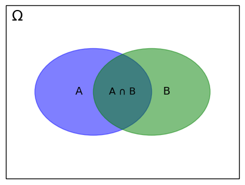

# Probabilidad

La probabilidad es una medida de la certidumbre asociada a un suceso o evento futuro y suele expresarse como un número entre 0 y 1 (o entre 0% y 100%). Un suceso seguro tiene probabilidad 1 (o 100%), mientras que un suceso imposible tiene probabilidad 0 (o 0%). De ese modo, si la probabilidad de que un evento suceda es P(s), la probabilidad de que no suceda es 1 - P(s).

## Interpretación frecuentista

La probabilidad frecuentista se basa en la frecuencia de ocurrencia de un suceso en un número de repeticiones del experimento. Por ejemplo, la probabilidad de obtener un 6 al lanzar el dado es 1/6, porque que en un gran número de lanzamientos de un dado, se espera que tienda a aparecer un 6 una de cada 6 veces que se lanza.

Los enfoques frecuentistas en el aprendizaje automático se aplican a problemas diversos, como la predicción de ventas, donde la regresión lineal se utiliza para prever futuras ventas basadas en datos históricos, considerando variables como publicidad, estacionalidad y precios. En el campo de la salud, se emplean pruebas de hipótesis para evaluar la efectividad de nuevos fármacos mediante ensayos clínicos y análisis estadístico. En el ámbito financiero, los modelos de series temporales ayudan a prever el comportamiento del mercado de valores utilizando datos históricos para decisiones de inversión.

## Interpretación bayesiana

La probabilidad bayesiana se basa en el conocimiento previo de un suceso. Por ejemplo, la probabilidad de que llueva mañana se puede estimar en función de la probabilidad de que llueva en días anteriores, la probabilidad de que llueva hoy y la probabilidad de que llueva en días futuros.

La inferencia bayesiana desempeña un papel crucial en diversas aplicaciones de aprendizaje automático, especialmente en casos donde se necesita cuantificar la incertidumbre o cuando es necesario actualizar continuamente creencias basadas en nueva evidencia. En el ámbito médico, las redes bayesianas ayudan en el diagnóstico de enfermedades al considerar síntomas, historial del paciente y resultados de pruebas, actualizando las probabilidades a medida que se dispone de nueva información. En el procesamiento del lenguaje natural, los métodos bayesianos son fundamentales para la modelación del lenguaje, facilitando tareas como el reconocimiento de voz, la comprensión semántica y la predicción de la siguiente palabra en una oración. En seguridad de redes, se utilizan métodos bayesianos para detectar anomalías en el tráfico de la red mediante la modelación de patrones regulares y la identificación de desviaciones que podrían indicar amenazas cibernéticas. Desde análisis financiero hasta sistemas de recomendación personalizados, la inferencia bayesiana se emplea para mejorar la toma de decisiones continuamente actualizando creencias en diferentes dominios.

## Probabilidad condicionada

La probabilidad condicionada es la probabilidad de que ocurra un evento dado que otro evento ya ha ocurrido. Por ejemplo, la probabilidad de que un paciente tenga cáncer dado que la prueba de detección de cáncer es positiva.

Si tomamos un espacio muestral $\Omega,$ (el conjunto de todos los eventos que tendremos en consideración) y dos eventos $A$ y $B$ en $\Omega$ con $P(B) > 0$.

Entonces la probabilidad condicionada de $A$ dado $B$ es:

$$ P(A|B) = \frac{P(A \cap B)}{P(B)} $$

## Fuentes

- <https://machinelearningmastery.com/what-is-probability/>
- <https://courses.cs.washington.edu/courses/cse312/18wi/312A/lecture7.pdf>
