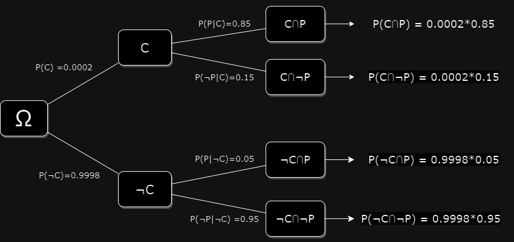
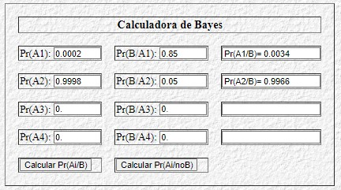

# Test de Cáncer

## Enunciado

En un determinado grupo poblacional, la probabilidad de tener cáncer es del 0,02%. Por otro lado, existe una prueba para detectarlo que no siempre es precisa. En caso de tener cáncer, arroja un resultado positivo el 85% de las veces, y en caso de no tener cáncer, arroja un resultado negativo el 95% de las veces. Calcular la probabilidad de que se tenga cáncer si la prueba da positiva.

## Solución

### Notación

Definimos los siguientes eventos:

* $C$: el paciente tiene cáncer.
* $\neg C$: el paciente no tiene cáncer.
* $P$: el resultado de la prueba es positivo.
* $\neg P$: el resultado de la prueba es negativo.

### Análisis

Algunas veces una prueba puede salir negativa pese a que el paciente tenga la enfermedad (falso negativo). La probabilidad con la que se evitan estos casos es la sensibilidad o verdadera tasa positiva:

$$ Sensibilidad = P(Prueba=Positiva | C=Verdadero)  = \mathbf{ P(P|C) = 0,85 } $$

Es decir, de todas las personas que tienen cáncer y se hacen pruebas, el 85% de ellas obtendrá un resultado positivo de la prueba.

Otras veces una prueba puede salir positiva pese a que el paciente no tenga la enfermedad (falso positivo). La probabilidad con la que se evitan estos casos es la especificidad o verdadera tasa negativa:

$$ Especificidad = P (Prueba = Negativa | C = Falso) = \\
\mathbf{ P(\neg P | \neg C) =0,95} $$

Dada esta información, la intuición nos podría sugerir que hay un 85% de probabilidad de que el paciente tenga cáncer. Este sesgo cognitivo al interpretar las probabilidades se conoce como sesgo (o falacia) de la frecuencia base.

Tiene este nombre porque el error al estimar la probabilidad de un evento es causado por ignorar la tasa base. Es decir, ignorar la probabilidad de tener cáncer, independientemente de la prueba de diagnóstico.

En este caso, la probabilidad de tener cáncer es baja: 0.02 %. Entendemos que la probabilidad de que un paciente tenga una enfermedad es la cantidad de pacientes con la enfermedad dividido por el total de pacientes. Esto es lo que en epidemiología se conoce como **prevalencia** de la enfermedad.

$$  \mathbf{P(C) = 0.0002} $$

Partiendo de estos datos, podemos fácilmente calcular las probabilidades complementarias:

* La probabilidad de que el paciente no tenga cáncer. Esta probabilidad es la complementaria de la probabilidad de que el paciente tenga cáncer.

$$ \mathbf{ P(\neg C) = 1 - P(C) } = 1 - 0,0002= \mathbf{ 0,9998 } $$

* La probabilidad de que el resultado sea positivo dado que el paciente no tiene cáncer es la probabilidad de un falso positivo, que es la inversa de la especificidad.

$$ \mathbf{ P(P|\neg C) = 1 - P(Negativo|\neg C) } = 1 - 0,95= \mathbf{ 0,05} $$

Podemos representar el espacio muestral como un árbol:

### Desarrollo

Podemos calcular correctamente la probabilidad de que un paciente realmente tenga cáncer tras un resultado positivo del test usando el **Teorema de Bayes**.

$$ \mathbf{ P (C|P) = \frac{P (P|C) \times P (C)}{P(P)} } $$
$$ P (C|P) = \frac{0.85 \times 0.0002}{P(P)} $$

El enunciado no nos da explícitamente la probabilidad de que una prueba de positivo en general; o sea: el porcentaje de todos los tests realizados que dan resultado positivo, sea este verdadero o falso.

Pero la probabilidad de que el resultado sea positivo, es la suma de las probabilidades de que el resultado sea positivo y el paciente tenga cáncer, y de que el resultado sea positivo y el paciente no tenga cáncer. O sea: la probabilidad de que el resultado sea positivo es la suma de la probabilidad de un verdadero positivo y de un falso positivo.

La probabilidad de un verdadero positivo es la probabilidad de que el paciente tenga cáncer y el resultado sea positivo , que es la probabilidad de que el paciente tenga cáncer por la probabilidad de que el resultado sea positivo dado que el paciente tiene cáncer.

$$ P(Verdadero\ P) = P(P \cap C) $$

que, aplicando la fórmula de la **probabilidad condicional** (el diagrama en árbol ilustra este teorema), es:

$$ \mathbf{ P(P\cap C) = P(P|C) \times P(C) }$$

Lo mismo aplica de modo análogo a la probabilidad de un falso positivo: es la probabilidad de que el paciente no tenga cáncer y el resultado sea positivo, que es la probabilidad de que el paciente no tenga cáncer por la probabilidad de que el resultado sea positivo dado que el paciente no tiene cáncer.

Por tanto, la probabilidad de que el resultado sea positivo es:

$$ P(P) = P(P\cap C) + P(P\cap \neg C) = $$

$$ P(P) = P(P|C) \times P(C) + P(P|\neg C) \times P(\neg C) $$

que viene a ser el [teorema de probabilidad total](https://es.wikipedia.org/wiki/Teorema_de_la_probabilidad_total).

así que podemos desarrollar la fórmula de Bayes de la siguiente manera:

$$ \mathbf{ P(C|P) = \frac{P (P|C)\times P(C)}
{P(P|C)\times P(C) + P(P|\neg C) \times P(\neg C)} } = \frac{0,85 \times 0,0002}{0,85 \times 0,0002 + 0,05 \times 0,9998} \approx 0.0034 $$

Es decir, aún con un el resultado de la prueba positivo, la probabilidad de que el paciente tenga cáncer sería de solo el 0.34%. **Esto se debe a que la población de pacientes con cáncer es muy pequeña en comparación con la población de pacientes sin cáncer**.

Comprobando en la [calculadora de Bayes](https://www.ugr.es/~jsalinas/bayes.htm):

## Variación del enunciado, con prevalencia del 2%

Si suponemos que hay una errata en el enunciado y que la prevalencia del cáncer es del 2% en la población general (en lugar del 0,02%), la probabilidad de que el paciente tenga cáncer es del 2% y la probabilidad de que el paciente no tenga cáncer es del 98%.

Con estos nuevos números la probabilidad de tener la enfermedad ante un resultado positivo de la prueba es:

$$ P(C|P) = \frac{0,85 \times 0,02}{0,85 \times 0,02 + 0,05 \times 0,98} \approx 0.26 $$

Es decir, con un resultado positivo de la prueba, la probabilidad de que el paciente tenga cáncer es del 26%.

Vemos como, [solo cambiando la prevalencia, la probabilidad de realmente tener cáncer ante un resultado positivo de la prueba cambia enormemente](https://es.wikipedia.org/wiki/Falacia_de_la_frecuencia_base).
